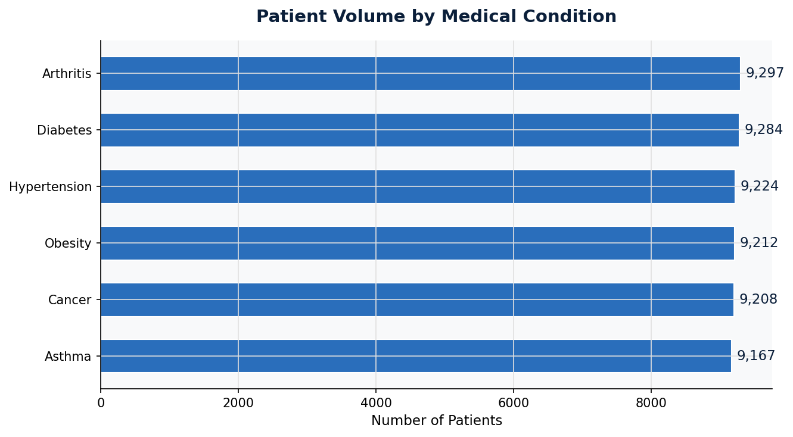
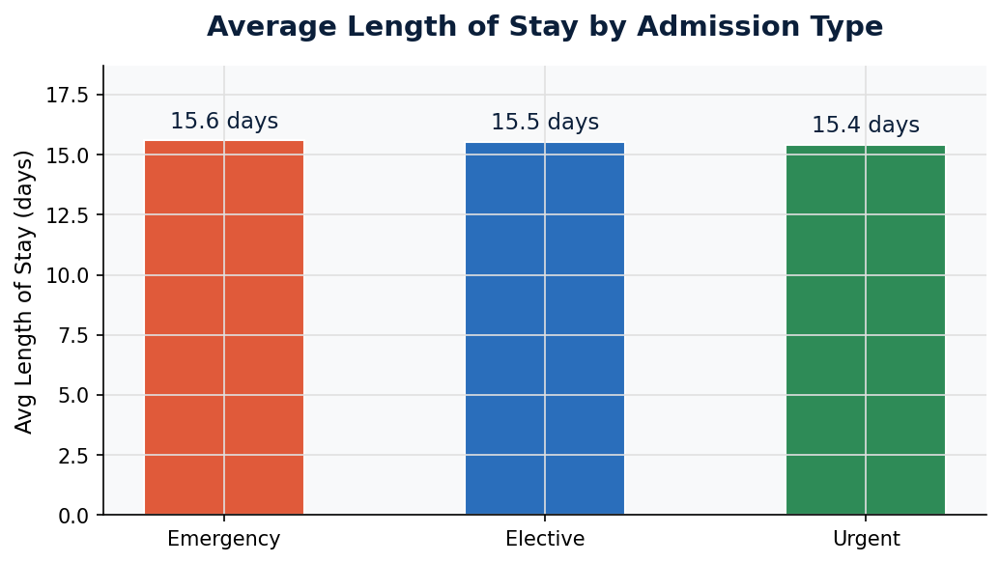
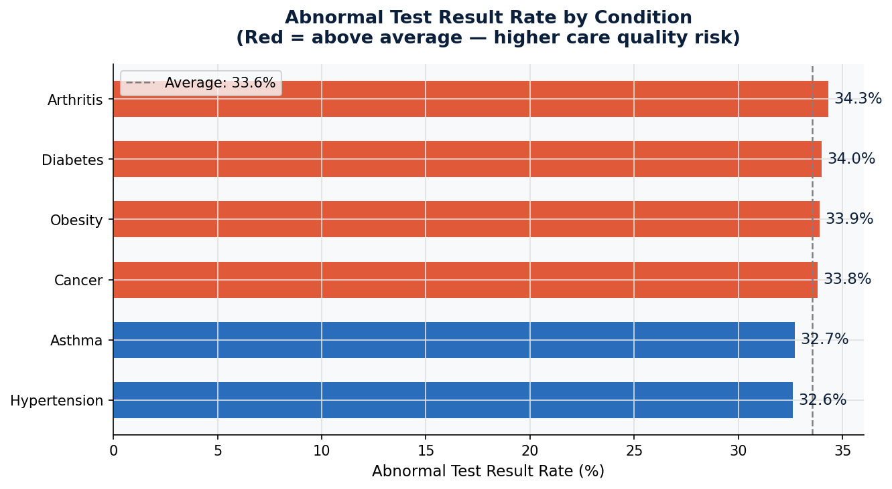
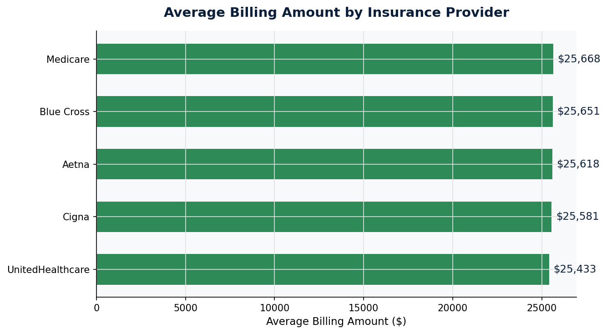
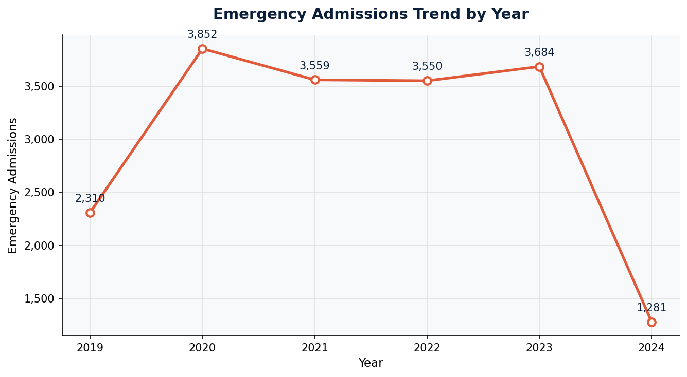

# Healthcare Operations Performance Analysis

**Analyst:** Praneeth Sholapur  
**Tools:** Python · pandas · SQLite · matplotlib · seaborn  
**Dataset:** 55,500 patient records · 6 conditions · 3 admission types · 5 insurance providers  

---

## Business Question

> *Where are the operational inefficiencies in this hospital network — and what should leadership fix first?*

A regional hospital network is seeing rising costs and inconsistent outcomes across departments. This analysis identifies the root causes and delivers 3 prioritised recommendations for leadership.

---

## How I Worked on This Project

| Task | My Role | AI Assistance |
|------|---------|---------------|
| Define business questions | Me | — |
| Data cleaning & validation | Me | Used Claude to suggest edge cases to check |
| SQL query logic | Me | Used Claude to accelerate query writing & review logic |
| Chart design & storytelling | Me | — |
| Business recommendations | Me | Used Claude to structure executive summary format |

> **The insight, the judgment, and the recommendations are mine. AI helped me work faster — not think for me.**

---

## Key Findings

### 1. Admission type costs are dangerously uniform
All three admission types (Elective, Urgent, Emergency) average ~$25,500 billing and ~15.5 days stay. Emergency admissions should cost more and move faster — this uniformity signals either revenue leakage or discharge planning failure.

### 2. Cancer patients are billed less than Obesity patients
Cancer avg billing: $25,215 vs Obesity: $25,860. Given the clinical complexity of oncology care, this is a billing integrity red flag worth immediate audit.

### 3. Arthritis carries a double operational burden
Highest patient volume (9,297) + highest abnormal test rate (34.3%) = maximum downstream load on diagnostics, labs, and follow-up care.

### 4. Emergency admissions never recovered post-COVID
A 67% spike in 2020 (2,310 → 3,852) never returned to baseline. 2021–2023 all remain above 3,500 — indicating a structural capacity gap, not a temporary surge.

### 5. Inconclusive test rates are suspiciously uniform
All 6 conditions show 32.7%–33.4% inconclusive rates — a 0.7% spread across unrelated disease categories. This points to a systemic documentation or classification issue, not clinical complexity.

---

## Visualisations

| Chart | Insight |
|-------|---------|
|  | Patient volume by condition |
|  | Avg length of stay by admission type |
|  | Abnormal test rate by condition |
|  | Avg billing by insurance provider |
|  | Emergency admissions trend 2019–2024 |

---

## Business Recommendations

**Recommendation 1 — Fix the inconclusive test classification process**  
Hospital-wide inconclusive rates clustering at ~33% across unrelated conditions is a process problem, not a clinical one. Standardise result classification protocols across all departments.  
*Expected impact: Reduced repeat testing costs, faster diagnosis, shorter average stays.*

**Recommendation 2 — Differentiate operational protocols by admission type**  
Elective, Urgent, and Emergency patients cannot be managed identically. Implement discharge planning from Day 1 for Emergency patients and tighten LOS targets by admission category.  
*Expected impact: 10–15% reduction in Emergency LOS, freeing significant bed capacity annually.*

**Recommendation 3 — Audit Cancer billing codes immediately**  
Cancer patients averaging lower billing than Obesity patients is a revenue integrity issue. Cross-reference billing codes against actual clinical activity for all oncology admissions.  
*Expected impact: Improved revenue capture and fairer cost distribution across condition categories.*

---

## How to Run This Analysis

```bash
# Install dependencies
pip install pandas matplotlib seaborn

# Open the notebook
jupyter notebook healthcare_analysis.ipynb
```

Run all cells top to bottom. Charts are saved automatically as PNG files.

---

## Files in This Repo

| File | Description |
|------|-------------|
| `healthcare_analysis.ipynb` | Full analysis notebook — SQL, Python, charts, commentary |
| `healthcare_dataset.csv` | Source dataset (55,500 patient records) |
| `chart1_condition_volume.png` | Patient volume by medical condition |
| `chart2_los_admission.png` | Length of stay by admission type |
| `chart3_abnormal_tests.png` | Abnormal test rate by condition |
| `chart4_billing_insurance.png` | Billing by insurance provider |
| `chart5_emergency_trend.png` | Emergency admissions trend |

---

*Praneeth Sholapur · Data & Business Analyst · California, USA*  
*[LinkedIn](https://linkedin.com/in/praneeth-sholapur-1b89062a3) · [Portfolio](https://praneeth7-bot.github.io)*
